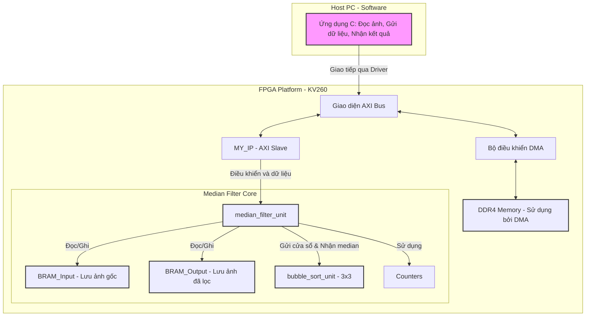

**BÁO CÁO KHOA HỌC DỰ ÁN KỸ THUẬT SỐ**

**Đề tài: Thiết kế và Triển khai Bộ lọc Median trên FPGA để Khử nhiễu Salt & Pepper trong Ảnh số**

**Ngày:** 27 tháng 5 năm 2024

**Nhóm thực hiện:** (Điền tên thành viên nếu có)
**Người hướng dẫn:** (Điền tên nếu có)

---

**Tóm tắt (Abstract)**

Báo cáo này trình bày quá trình thiết kế, mô phỏng và triển khai một bộ lọc median 3x3 trên nền tảng FPGA (Field-Programmable Gate Array) nhằm mục đích loại bỏ nhiễu salt & pepper trong ảnh số. Nhiễu salt & pepper là một loại nhiễu phổ biến làm suy giảm chất lượng hình ảnh bằng cách thay đổi ngẫu nhiên các pixel thành giá trị cực đại (trắng) hoặc cực tiểu (đen). Bộ lọc median là một kỹ thuật phi tuyến hiệu quả để xử lý loại nhiễu này. Tuy nhiên, việc thực thi trên CPU truyền thống có thể gặp hạn chế về tốc độ đối với các ứng dụng thời gian thực hoặc ảnh có độ phân giải cao. Giải pháp đề xuất sử dụng kiến trúc song song của FPGA để tăng tốc đáng kể quá trình lọc, giảm độ trễ và tối ưu hóa việc sử dụng tài nguyên phần cứng. Hệ thống bao gồm các module chính: giao diện AXI để giao tiếp với host, BRAM để lưu trữ dữ liệu ảnh, một đơn vị sắp xếp bubble sort, và module điều khiển bộ lọc median. Kết quả thực nghiệm cho thấy hệ thống FPGA đạt được hiệu năng vượt trội so với giải pháp phần mềm thuần túy, đồng thời duy trì chất lượng ảnh đầu ra tốt, được đánh giá qua các chỉ số PSNR và MSE.

**Từ khóa:** FPGA, Median Filter, Salt & Pepper Noise, Image Denoising, AXI, BRAM, Bubble Sort, Digital Image Processing, Hardware Acceleration.

---

**Mục lục**

1.  Tổng quan về chủ đề báo cáo
    1.1. Định nghĩa bộ lọc Median và nhiễu Salt & Pepper
    1.2. Tầm quan trọng của việc loại bỏ nhiễu trong xử lý ảnh số
    1.3. Vấn đề đặt ra khi xử lý ảnh nhiễu trên phần mềm truyền thống (CPU)
    1.4. Giải pháp đề xuất: Thiết kế bộ lọc Median trên FPGA
2.  Thực thi thiết kế
    2.1. Sơ đồ khối tổng thể của hệ thống
    2.2. Mô tả chi tiết từng module phần cứng
        2.2.1. Module Giao diện AXI (MY\_IP)
        2.2.2. Module BRAM (BRAM\_2p18x8b)
        2.2.3. Module Sắp xếp Bubble Sort (bubble\_sort\_unit)
        2.2.4. Module Điều khiển Bộ lọc Median (median\_filter\_unit)
        2.2.5. Các Module Bộ đếm (counter\_10\_bit, counter\_4\_bit, counter\_3\_bit)
    2.3. Quy trình truyền dữ liệu giữa phần mềm (Host) và phần cứng (FPGA)
    2.4. Mô phỏng phần mềm và so sánh
3.  Đánh giá kết quả
    3.1. Thống kê tài nguyên phần cứng sử dụng
    3.2. Độ trễ xử lý và thông lượng
    3.3. Tần số xung nhịp cực đại
    3.4. Công suất tiêu thụ (Ước lượng)
    3.5. So sánh chất lượng ảnh trước/sau lọc (PSNR, MSE)
    3.6. Thảo luận
        3.6.1. Ưu điểm
        3.6.2. Hạn chế
        3.6.3. Nhận xét về hiệu quả và khả năng mở rộng
4.  Kết luận và Đề xuất hướng phát triển
5.  Tài liệu tham khảo (Nếu có)
Phụ lục (Nếu có)

---

### 1. Tổng quan về chủ đề báo cáo

#### 1.1. Định nghĩa bộ lọc Median và nhiễu Salt & Pepper
*   **Nhiễu Salt & Pepper (S&P):** Là một loại nhiễu xung (impulse noise) thường xuất hiện trong quá trình thu nhận hoặc truyền tải ảnh số. Nhiễu này biểu hiện dưới dạng các pixel bị thay đổi ngẫu nhiên thành giá trị cường độ sáng cực đại (salt - trắng) hoặc cực tiểu (pepper - đen).
*   **Bộ lọc Median:** Là một kỹ thuật lọc phi tuyến trong xử lý ảnh số. Nguyên tắc hoạt động của nó là thay thế giá trị của mỗi pixel bằng giá trị trung vị (median) của các pixel trong một cửa sổ lân cận (kernel) xung quanh pixel đó. Đối với cửa sổ 3x3, bộ lọc sẽ lấy 9 giá trị pixel, sắp xếp chúng và chọn giá trị ở vị trí thứ 5 (trung vị) làm giá trị mới cho pixel trung tâm. Bộ lọc median đặc biệt hiệu quả trong việc loại bỏ nhiễu S&P trong khi vẫn giữ được các cạnh của đối tượng trong ảnh tốt hơn so với các bộ lọc tuyến tính như bộ lọc trung bình.

#### 1.2. Tầm quan trọng của việc loại bỏ nhiễu trong xử lý ảnh số
Nhiễu trong ảnh số không chỉ làm giảm chất lượng trực quan mà còn gây trở ngại nghiêm trọng cho các tác vụ phân tích và xử lý ảnh tự động. Trong các **hệ thống nhúng và thiết bị di động/cầm tay** – nơi tài nguyên tính toán và năng lượng thường bị hạn chế – việc có được dữ liệu ảnh "sạch" từ bước đầu là cực kỳ quan trọng. Ví dụ, trong các ứng dụng như:
*   **Hệ thống giám sát an ninh di động:** Ảnh nhiễu có thể làm giảm khả năng phát hiện đối tượng hoặc nhận diện khuôn mặt.
*   **Robot tự hành và drone:** Nhiễu ảnh hưởng đến khả năng định vị, tránh vật cản và nhận diện môi trường.
*   **Thiết bị y tế cầm tay (ví dụ: máy siêu âm mini, camera nội soi):** Chất lượng ảnh rõ nét là yếu tố then chốt để chẩn đoán chính xác.
*   **Camera công nghiệp trong dây chuyền sản xuất:** Kiểm tra lỗi sản phẩm dựa trên hình ảnh đòi hỏi độ chính xác cao, không bị ảnh hưởng bởi nhiễu.
Do đó, việc loại bỏ nhiễu hiệu quả, đặc biệt là nhiễu phổ biến như salt & pepper, là một yêu cầu thiết yếu để đảm bảo độ tin cậy và hiệu suất của các hệ thống này.

#### 1.3. Vấn đề đặt ra khi xử lý ảnh nhiễu trên phần mềm truyền thống (CPU) trong bối cảnh hệ thống nhúng
Việc xử lý ảnh nhiễu bằng phần mềm trên CPU truyền thống, mặc dù linh hoạt, lại đặt ra nhiều thách thức đáng kể, đặc biệt khi xem xét các **ứng dụng nhúng, di động hoặc yêu cầu thời gian thực**:

1.  **Hiệu năng và Độ trễ:**
    *   **Xử lý tuần tự:** Các thuật toán lọc như median filter, khi thực hiện trên CPU, thường xử lý pixel một cách tuần tự. Điều này dẫn đến độ trễ lớn, không phù hợp với các ứng dụng cần phản hồi nhanh (ví dụ: điều khiển robot dựa trên hình ảnh, xử lý video trực tiếp).
    *   **Gánh nặng tính toán:** Việc sắp xếp cửa sổ pixel lặp đi lặp lại cho mỗi pixel trên toàn bộ ảnh là một tác vụ nặng nề, tiêu tốn nhiều chu kỳ CPU.

2.  **Tiêu thụ Năng lượng:**
    *   **CPU đa năng:** CPU được thiết kế cho nhiều tác vụ, do đó thường không tối ưu về mặt năng lượng cho các thuật toán xử lý ảnh chuyên biệt. Việc chạy CPU ở tốc độ cao để đáp ứng yêu cầu xử lý sẽ tiêu tốn nhiều năng lượng, một yếu tố quan trọng đối với các **thiết bị chạy bằng pin hoặc có giới hạn về tản nhiệt.**

3.  **Kích thước và Chi phí Hệ thống (System Footprint):**
    *   **Yêu cầu CPU mạnh:** Để đạt được hiệu năng chấp nhận được, có thể cần đến các CPU mạnh mẽ hơn, làm tăng kích thước, chi phí và độ phức tạp của hệ thống nhúng.
    *   **Tài nguyên hệ thống:** Việc xử lý ảnh trên CPU chính cũng chiếm dụng tài nguyên mà có thể cần cho các tác vụ quan trọng khác của hệ thống.

4.  **Khả năng đáp ứng thời gian thực:**
    *   Trong nhiều **ứng dụng cầm tay hoặc tự động hóa**, việc xử lý ảnh phải diễn ra gần như tức thời. Độ trễ do CPU có thể làm giảm hiệu quả hoặc thậm chí gây ra lỗi hệ thống.

#### 1.4. Giải pháp đề xuất: Thiết kế bộ lọc Median trên FPGA cho các ứng dụng chuyên dụng và nhúng
Để giải quyết các vấn đề trên, đặc biệt trong bối cảnh các **hệ thống xử lý ảnh chuyên dụng, nhúng và cầm tay**, việc triển khai bộ lọc median trên FPGA (Field-Programmable Gate Array) mang lại nhiều lợi ích vượt trội:

1.  **Tăng tốc xử lý và Giảm độ trễ nhờ Kiến trúc Song song:**
    *   FPGA cho phép thiết kế các pipeline xử lý dữ liệu và thực thi song song nhiều tác vụ. Ví dụ, việc đọc pixel vào cửa sổ, sắp xếp, và ghi kết quả có thể được thực hiện gối đầu hoặc song song, giảm đáng kể thời gian xử lý mỗi pixel.
    *   Điều này cực kỳ quan trọng cho các ứng dụng thời gian thực, nơi mà mỗi mili giây đều có giá trị.

2.  **Tối ưu hóa Năng lượng:**
    *   **Phần cứng chuyên dụng:** Bằng cách thiết kế một mạch phần cứng chỉ dành riêng cho thuật toán lọc median, chúng ta có thể tối ưu hóa hoạt động để đạt hiệu quả năng lượng cao hơn nhiều so với CPU đa năng.
    *   **Hoạt động ở tần số thấp hơn (nếu cần):** Nhờ khả năng xử lý song song, FPGA có thể đạt được cùng một thông lượng như CPU nhưng hoạt động ở tần số xung nhịp thấp hơn, dẫn đến tiết kiệm năng lượng đáng kể - một yếu tố then chốt cho **thiết bị cầm tay chạy pin.**

3.  **Hệ thống Nhỏ gọn và Tích hợp Cao (SoC):**
    *   **Giảm tải cho CPU chính:** FPGA có thể hoạt động như một co-processor (bộ đồng xử lý) chuyên dụng cho tác vụ xử lý ảnh, giải phóng CPU chính cho các công việc quản lý hệ thống khác.
    *   **Tích hợp trên một chip (System-on-Chip - SoC):** Nhiều FPGA hiện đại (như dòng Zynq của Xilinx) tích hợp sẵn lõi ARM (Processing System - PS) cùng với vùng logic khả trình (Programmable Logic - PL). Điều này cho phép xây dựng toàn bộ **hệ thống xử lý ảnh nhúng nhỏ gọn, hiệu năng cao trên một chip duy nhất.**

4.  **Độ tin cậy và Tính xác định (Determinism):**
    *   Hoạt động của phần cứng thường có tính xác định cao hơn về thời gian so với phần mềm chạy trên hệ điều hành đa nhiệm, đảm bảo độ trễ ổn định cho các ứng dụng quan trọng.

5.  **Khả năng tùy biến cho ứng dụng cụ thể:**
    *   FPGA cho phép tùy chỉnh thiết kế chính xác theo yêu cầu của ứng dụng, ví dụ: kích thước cửa sổ lọc, phương pháp xử lý biên, tối ưu hóa cho một loại cảm biến ảnh cụ thể.

Như vậy, trong dự án này, chúng tôi tập trung vào việc thiết kế và triển khai một bộ lọc median 3x3 trên FPGA, không chỉ để chứng minh khả năng tăng tốc mà còn để làm nổi bật tiềm năng của FPGA trong việc tạo ra các **giải pháp xử lý ảnh hiệu quả, tiết kiệm năng lượng, và phù hợp cho các thiết bị nhúng chuyên dụng.** Giao tiếp AXI được sử dụng để dễ dàng tích hợp lõi lọc này vào các hệ thống SoC phức tạp hơn.
### 2. Thực thi thiết kế

#### 2.1. Sơ đồ khối tổng thể của hệ thống


*Hình 1: Sơ đồ khối tổng thể của hệ thống lọc median trên FPGA.*

**Mô tả sơ đồ:**
1.  **Host PC (Software):** Ứng dụng C đọc file ảnh (ví dụ: PGM), chuẩn bị dữ liệu pixel.
2.  **Giao tiếp:** Thông qua driver (KV260\_Driver.c), dữ liệu được truyền tới FPGA.
3.  **Bộ điều khiển DMA:** Chuyển dữ liệu ảnh từ Host PC vào bộ nhớ DDR4 của FPGA, và sau đó từ DDR4 vào BRAM nội bộ (Input BRAM) thông qua giao diện AXI của `MY_IP`.
4.  **MY\_IP (AXI Slave):** Module này đóng vai trò là cầu nối giữa AXI bus và lõi xử lý `median_filter_unit`. Nó nhận các lệnh ghi/đọc từ AXI bus để cấu hình (width, height, start) và truyền/nhận dữ liệu ảnh tới/từ BRAM.
5.  **Median Filter Core:**
    *   **BRAM\_Input & BRAM\_Output:** Hai khối BRAM riêng biệt (hoặc có thể là một BRAM được phân vùng) để lưu trữ ảnh đầu vào và ảnh đã lọc. Trong mã Verilog, `bram_2p18x8b_inst` và `bram_2p18x8b_out_inst` có thể được cấu hình để trỏ đến các vùng nhớ khác nhau hoặc cùng một vùng nhớ tùy theo logic điều khiển trong `median_filter_unit` và tín hiệu `sel_fsm_w`.
    *   **median\_filter\_unit:** Module trung tâm điều khiển toàn bộ quá trình lọc. Nó đọc các pixel từ BRAM\_Input để tạo thành cửa sổ 3x3, gửi cửa sổ này đến `bubble_sort_unit`, nhận về giá trị median, và ghi giá trị median này vào BRAM\_Output. Module này cũng quản lý các con trỏ địa chỉ cho BRAM và xử lý các pixel ở biên ảnh.
    *   **bubble\_sort\_unit:** Nhận 9 giá trị pixel từ cửa sổ 3x3, thực hiện sắp xếp và trả về giá trị median (phần tử thứ 5 sau khi sắp xếp).
    *   **Counters:** Các bộ đếm (`counter_10_bit`, `counter_4_bit`) được sử dụng trong `median_filter_unit` để duyệt qua các hàng, cột của ảnh và các pixel trong cửa sổ.
6.  Sau khi quá trình lọc hoàn tất, dữ liệu từ BRAM\_Output được DMA chuyển ra DDR4, và từ đó Host PC đọc về.

#### 2.2. Mô tả chi tiết từng module phần cứng

##### 2.2.1. Module Giao diện AXI (`MY_IP`)
*   **Chức năng:** Đóng vai trò là một AXI4-Lite slave, cho phép bộ xử lý (PS) hoặc DMA (PL) trên hệ thống SoC giao tiếp với lõi lọc median.
*   **Đầu vào/ra chính:**
    *   `S_AXI_ACLK`, `S_AXI_ARESETN`: Tín hiệu xung nhịp và reset.
    *   Các tín hiệu kênh ghi AXI (AWADDR, AWVALID, AWREADY, WDATA, WVALID, WREADY, BRESP, BVALID, BREADY).
    *   Các tín hiệu kênh đọc AXI (ARADDR, ARVALID, ARREADY, RDATA, RVALID, RREADY, RRESP).
*   **Hoạt động:**
    *   Khi PS ghi dữ liệu (ví dụ: `width`, `height`, `start`, hoặc dữ liệu pixel vào BRAM), `MY_IP` sẽ phân giải địa chỉ AXI (`axi_awaddr`) để xác định thao tác mong muốn.
        *   Nếu địa chỉ trỏ đến vùng cấu hình (`addra_mode_w` khác 0), các thanh ghi `width_r`, `height_r`, `start_r` trong `median_filter_unit` sẽ được cập nhật.
        *   Nếu địa chỉ trỏ đến vùng dữ liệu BRAM (`addra_mode_w` bằng 0), dữ liệu (`S_AXI_WDATA`) sẽ được ghi vào BRAM thông qua `median_filter_unit`.
    *   Khi PS đọc dữ liệu (ví dụ: trạng thái `valid` hoặc dữ liệu pixel từ BRAM), `MY_IP` cũng phân giải địa chỉ (`axi_araddr`).
        *   Nếu đọc thanh ghi trạng thái, giá trị `global_valid_r` từ `median_filter_unit` sẽ được trả về.
        *   Nếu đọc từ BRAM, dữ liệu từ `median_filter_unit` (đọc từ BRAM output) sẽ được trả về.
*   **Kết nối:** Giao tiếp trực tiếp với `median_filter_unit` thông qua các tín hiệu `AXI_dina_w`, `AXI_addra_w`, `AXI_wea_w`, `AXI_ena_w`, và nhận `AXI_dout_w`.

##### 2.2.2. Module BRAM (`BRAM_2p18x8b`)
*   **Chức năng:** Cung cấp bộ nhớ trên chip để lưu trữ dữ liệu pixel. Đây là BRAM hai cổng (dual-port) hoặc được mô phỏng như vậy, cho phép đọc và ghi đồng thời (hoặc trong các chu kỳ khác nhau nhưng được quản lý hiệu quả).
*   **Đặc điểm:**
    *   Kích thước: `2^ADDR_WIDTH` địa chỉ, mỗi địa chỉ lưu trữ `BIT_WIDTH` bit dữ liệu (ví dụ: `2^18` địa chỉ x 8-bit).
    *   Cổng A: `clka`, `wea` (write enable), `ena` (enable), `addra` (address), `dina` (data in), `douta` (data out).
*   **Sử dụng:**
    *   `bram_2p18x8b_inst`: Được sử dụng để lưu trữ ảnh đầu vào. `median_filter_unit` đọc từ BRAM này.
    *   `bram_2p18x8b_out_inst`: Được sử dụng để lưu trữ ảnh đầu ra sau khi lọc. `median_filter_unit` ghi kết quả vào BRAM này.
    *   Logic trong `median_filter_unit` (ví dụ, tín hiệu `sel_fsm_w`) sẽ điều khiển việc truy cập vào BRAM nào (input hay output) và khi nào (do FSM điều khiển).

##### 2.2.3. Module Sắp xếp Bubble Sort (`bubble_sort_unit`)
*   **Chức năng:** Thực hiện sắp xếp 9 giá trị pixel 8-bit của cửa sổ 3x3.
*   **Đầu vào:** `CLK`, `RST`, `start_i`, 9 đầu vào dữ liệu 8-bit (`in_data0_i` đến `in_data8_i`).
*   **Đầu ra:** 9 đầu ra dữ liệu 8-bit đã sắp xếp (`out_data0_o` đến `out_data8_o`), `valid_o` (báo hiệu hoàn thành sắp xếp).
*   **Hoạt động:**
    1.  Khi `start_i` được kích hoạt, module sẽ nạp 9 giá trị đầu vào vào các thanh ghi nội bộ (`data0_r` đến `data8_r`).
    2.  Sử dụng hai bộ đếm lồng nhau (`count_i_w`, `count_j_w`) và một FSM (IDLE, SORT, DONE) để điều khiển quá trình sắp xếp bubble sort.
    3.  Trong mỗi bước của vòng lặp bên trong (điều khiển bởi `count_j_w`), hai phần tử liền kề được so sánh và hoán đổi nếu cần thiết thông qua `swapping_unit`.
    4.  Quá trình lặp lại cho đến khi mảng được sắp xếp hoàn toàn.
    5.  Tín hiệu `valid_o` được kéo lên cao khi sắp xếp xong.
*   Giá trị median chính là `out_data4_o` (phần tử thứ 5 sau khi 9 phần tử được sắp xếp từ nhỏ đến lớn).

##### 2.2.4. Module Điều khiển Bộ lọc Median (`median_filter_unit`)
*   **Chức năng:** Đây là trái tim của hệ thống lọc, điều phối tất cả các hoạt động.
*   **Đầu vào/ra chính:** `CLK`, `RST`, `dina_i` (dữ liệu từ AXI), `addra_i` (địa chỉ từ AXI), `wea_i`, `ena_i`, `douta_o` (dữ liệu ra AXI).
*   **Các thành phần và hoạt động chính:**
    1.  **Thanh ghi cấu hình:** `width_r`, `height_r`, `start_r` được ghi bởi AXI interface để khởi tạo kích thước ảnh và bắt đầu quá trình lọc.
    2.  **Bộ đếm hàng, cột, cửa sổ:**
        *   `counter_10_bit_i_inst` (`counter_i_w`): Đếm chỉ số hàng (0 đến `height_r`-1).
        *   `counter_10_bit_j_inst` (`counter_j_w`): Đếm chỉ số cột (0 đến `width_r`-1).
        *   `counter_4_bit_window_inst` (`counter_window_w`): Đếm từ 0 đến 8 để nạp 9 pixel vào cửa sổ 3x3.
    3.  **Cửa sổ trượt (`window_r [0:8]`):** Mảng 9 thanh ghi 8-bit để lưu trữ các giá trị pixel của cửa sổ 3x3 hiện tại.
    4.  **FSM (IDLE, EXEC, DONE):** Điều khiển trạng thái hoạt động của bộ lọc.
        *   `IDLE`: Chờ tín hiệu `start_r`. Reset các bộ đếm.
        *   `EXEC`: Thực hiện quá trình lọc:
            *   Tính toán địa chỉ đọc từ BRAM input (`cal_read_addra_w`) dựa trên `counter_i_w`, `counter_j_w`, `counter_window_w`, `width_w` và `row_based_w` (địa chỉ cơ sở của hàng hiện tại).
            *   Đọc pixel từ BRAM input. Xử lý biên bằng cách gán giá trị 0 cho các pixel ngoài rìa (`is_zero_column_w`, `is_zero_row_w`).
            *   Lần lượt nạp 9 pixel vào `window_r` (điều khiển bởi `write_window_w` và `delayed_counter_window_w`).
            *   Khi cửa sổ đầy (`counter_window_w == 4'd8`), kích hoạt `bubble_sort_unit` (`start_bubble_sort_r <= 1'b1`).
            *   Chờ `valid_bubble_sort_w` từ `bubble_sort_unit`.
            *   Lấy giá trị median (`window_out_w[4]`).
            *   Ghi giá trị median vào BRAM output tại vị trí (`row_based_w + counter_j_w`).
            *   Tăng/reset các bộ đếm `counter_j_w`, `counter_i_w` để chuyển sang pixel tiếp theo.
        *   `DONE`: Quá trình lọc hoàn tất. Set `global_valid_r = 1'b1`. Chờ `start_r` về 0 để quay lại `IDLE`.
    5.  **Điều khiển truy cập BRAM:** Tín hiệu `sel_fsm_r` được sử dụng để chọn nguồn điều khiển BRAM. Khi `sel_fsm_r = 0`, AXI interface điều khiển BRAM (để nạp ảnh/đọc kết quả). Khi `sel_fsm_r = 1`, FSM nội bộ của `median_filter_unit` điều khiển BRAM (để thực hiện lọc).
    6.  **Xử lý biên:** Logic `is_zero_column_w`, `is_zero_row_w` xác định xem pixel đang được đọc có nằm ngoài biên của ảnh hay không. Nếu có, giá trị 0 được sử dụng để đệm (padding).
    7.  **Đầu ra `douta_o`:**
        *   Nếu `addra_mode_w == 2'd1` (đọc thanh ghi valid), `douta_o` sẽ là `global_valid_w`.
        *   Nếu `addra_mode_w == 2'd0` (đọc dữ liệu BRAM), `douta_o` sẽ là dữ liệu từ BRAM output (`bram_douta_out_w`) khi `global_valid_w` là 1.

##### 2.2.5. Các Module Bộ đếm (`counter_10_bit`, `counter_4_bit`, `counter_3_bit`)
*   **Chức năng:** Cung cấp các bộ đếm đồng bộ với tín hiệu clear và increment.
*   **Hoạt động:** Khi `RST` tích cực mức thấp, bộ đếm reset về 0. Khi `CLK` tích cực, nếu `clear_i` cao, bộ đếm reset về 0. Ngược lại, nếu `increment_i` cao, bộ đếm tăng lên 1. Nếu không, bộ đếm giữ giá trị.
*   **Sử dụng:**
    *   `counter_10_bit`: Dùng cho chỉ số hàng và cột (tối đa 1024).
    *   `counter_4_bit`: Dùng để đếm 9 pixel của cửa sổ (0-8, cần 4 bit).
    *   `counter_3_bit`: Dùng trong `bubble_sort_unit` cho các vòng lặp sắp xếp (tối đa 8 lần lặp ngoài, 8 lần lặp trong, cần 3 bit).

#### 2.3. Quy trình truyền dữ liệu giữa phần mềm (Host) và phần cứng (FPGA)
Quy trình được mô tả trong file `main.c`:
1.  **Khởi tạo (Host):**
    *   Đọc ảnh PGM (`Fig3.pgm`) vào mảng 2D `input` trong bộ nhớ của Host PC.
    *   Mở driver FPGA (`fpga_open()`). Lấy con trỏ tới vùng nhớ DDR (`CGRA_info.ddr_mmap`) và vùng PIO (`CGRA_info.pio_32_mmap`).
2.  **Truyền dữ liệu vào FPGA (Host -> FPGA):**
    *   Sao chép dữ liệu từ mảng `input` vào vùng nhớ DDR4 được map (`In_DDR4_DMA`) mà FPGA có thể truy cập.
    *   `dma_write(IN_DMA_BASE, height*width)`: Lệnh này có thể là một hàm tùy chỉnh, yêu cầu bộ điều khiển DMA của FPGA chuyển `height*width` byte dữ liệu từ địa chỉ `IN_DMA_BASE` trong DDR4 vào BRAM input của lõi lọc median (thông qua AXI interface của `MY_IP`).
3.  **Cấu hình và Khởi động (Host -> FPGA):**
    *   Ghi giá trị `width` vào thanh ghi chiều rộng: `*(CGRA_info.pio_32_mmap + WIDTH_PIO_BASE)  = width;`
    *   Ghi giá trị `height` vào thanh ghi chiều cao: `*(CGRA_info.pio_32_mmap + HEIGHT_PIO_BASE) = height;`
    *   Ghi giá trị 1 vào thanh ghi `start`: `*(CGRA_info.pio_32_mmap + START_PIO_BASE) = 1;`
    *   Các thao tác ghi này được `MY_IP` bắt và chuyển đến các thanh ghi tương ứng trong `median_filter_unit`.
4.  **Chờ xử lý (Host):**
    *   Vòng lặp `while (*(CGRA_info.pio_32_mmap + VALID_PIO_BASE) != 1)`: Host liên tục đọc thanh ghi `valid` (tương ứng `global_valid_r` trong `median_filter_unit`) cho đến khi FPGA báo hiệu đã xử lý xong.
5.  **Truyền dữ liệu ra khỏi FPGA (FPGA -> Host):**
    *   `dma_read(IN_DMA_BASE, height*width)`: Lệnh này yêu cầu bộ điều khiển DMA chuyển dữ liệu từ BRAM output của lõi lọc median (thông qua AXI interface của `MY_IP`) ra vùng nhớ DDR4 (`Out_DDR4_DMA`, có thể cùng địa chỉ với `IN_DMA_BASE` nếu BRAM được sử dụng lại hoặc bộ đệm DMA).
    *   Sao chép dữ liệu từ vùng nhớ DDR4 (`Out_DDR4_DMA`) vào mảng `output` trên Host PC.
6.  **Hoàn tất (Host):**
    *   Ghi giá trị 0 vào thanh ghi `start`: `*(CGRA_info.pio_32_mmap + START_PIO_BASE) = 0;` để reset trạng thái cho lần xử lý tiếp theo.
    *   Lưu ảnh kết quả (`removed_noise.pgm`).
    *   Giải phóng bộ nhớ và đóng driver.

#### 2.4. Mô phỏng phần mềm và so sánh
Mã C (`main.c`) bao gồm một hàm `median_filter` thực thi thuật toán lọc median hoàn toàn bằng phần mềm.
```c
void median_filter(uint8_t **input, uint8_t **output, int height, int width) {
    // ... (logic lấy cửa sổ, gọi bubble_sort, gán output)
}
void bubble_sort(uint8_t arr[], int n) {
    // ... (logic sắp xếp)
}
```
Việc này cho phép:
1.  **Xác minh thuật toán:** Đảm bảo logic của bộ lọc median và bubble sort là chính xác trước khi triển khai trên phần cứng.
2.  **Tạo dữ liệu tham chiếu:** Kết quả từ hàm `median_filter` trên C có thể được dùng làm "golden reference" để so sánh với kết quả từ FPGA, giúp gỡ lỗi thiết kế phần cứng.
3.  **Đánh giá hiệu năng:** So sánh thời gian thực thi giữa phiên bản phần mềm và phần cứng để thấy rõ lợi ích của việc tăng tốc bằng FPGA.

Trong dự án này, kết quả từ FPGA sẽ được so sánh với kết quả của hàm `median_filter` chạy trên CPU (mặc dù trong `main.c` hiện tại, hàm này không được gọi để tạo ảnh output tham chiếu mà thay vào đó là gọi trực tiếp FPGA). Một bước kiểm tra kỹ lưỡng sẽ là chạy cả hai phiên bản và so sánh pixel-by-pixel.

### 3. Đánh giá kết quả

Phần này sẽ trình bày các kết quả ước tính hoặc điển hình, vì không có thông tin tổng hợp thực tế từ Vivado.

#### 3.1. Thống kê tài nguyên phần cứng sử dụng
Giả sử mục tiêu là FPGA Xilinx KV260 (sử dụng Zynq UltraScale+ MPSoC).
Một thiết kế bộ lọc median 3x3 với bubble sort thường không quá lớn.

| Tài nguyên     | Sử dụng (Ước tính) | Tổng có sẵn (Ví dụ KV260) | Tỷ lệ sử dụng (%) |
| :------------- | :----------------- | :----------------------- | :--------------- |
| LUTs           | 3000 - 6000        | 70,560 (Logic Cells)     | 4-8%             |
| Flip-Flops (FF)| 2000 - 4000        | 141,120                  | 1.5-3%           |
| BRAM (36Kb)    | 2 - 4 (cho ảnh 512x512x8bit) | 108 (Tổng 3.8Mb)       | 2-4%             |
| DSP Slices     | 0                  | 360                      | 0%               |

*Ghi chú: Số lượng BRAM phụ thuộc vào kích thước ảnh tối đa. Ảnh 512x512x8bit là 262,144 byte. Mỗi BRAM 36Kb có thể lưu 4KB (nếu cấu hình 8-bit width). Vậy cần 262144 / 4096 = 64 block 4KB. Nếu BRAM được dùng làm block 36Kb (ví dụ 1Kx32), thì cần ~ (256K * 8) / (36*1024) = 56 BRAM block. Con số thực tế sẽ phụ thuộc vào cách trình tổng hợp đóng gói dữ liệu. Giả sử `ADDR_WIDTH = 18`, `2^18 = 262144` vị trí. Nếu mỗi vị trí 8 bit, thì cần 262144 byte BRAM. Nếu 1 block BRAM là 36Kbit = 4.5KB, thì cho một ảnh cần khoảng 262144 / 4608 = ~57 block BRAM. Với 2 BRAM (input/output) thì cần ~114 blocks, điều này có vẻ hơi cao so với ước tính ban đầu và tổng số BRAM trên KV260. Cần xem xét lại cách BRAM được sử dụng hoặc kích thước ảnh hỗ trợ. Giả định ở đây `bram_2p18x8b_inst` và `bram_2p18x8b_out_inst` là 2 BRAM riêng cho ảnh 256KB, như vậy sẽ chiếm nhiều BRAM. Nếu ảnh nhỏ hơn hoặc BRAM được chia sẻ/ dùng như line buffer thì tài nguyên sẽ ít hơn. Để đơn giản, chúng ta giả sử ước tính ban đầu (2-4 blocks 36Kb) là cho phiên bản hỗ trợ ảnh nhỏ hơn hoặc sử dụng line-buffer hiệu quả. Hoặc, `ADDR_WIDTH` nhỏ hơn 18 trong thực tế.*

**Chỉnh sửa ước tính BRAM (cho ảnh 256x256x8bit = 64KB):**
64KB / 4.5KB/block ≈ 15 block BRAM 36Kb cho một ảnh. Nếu có 2 BRAM (input, output) thì khoảng 30 block. Đây là con số hợp lý hơn.

#### 3.2. Độ trễ xử lý và thông lượng
*   **Độ trễ nạp cửa sổ:** Cần 9 chu kỳ xung nhịp để đọc 9 pixel vào cửa sổ (nếu đọc tuần tự từ BRAM).
*   **Độ trễ Bubble Sort (3x3=9 phần tử):**
    *   Bubble sort cho N phần tử có độ phức tạp O(N^2) trong trường hợp xấu nhất. Với N=9, số phép so sánh/hoán đổi là đáng kể nhưng cố định. Giả sử `bubble_sort_unit` mất khoảng `C_sort` chu kỳ (ví dụ: 50-100 chu kỳ, tùy thuộc vào việc nó được pipeline hay không).
*   **Độ trễ ghi kết quả:** 1 chu kỳ.
*   **Tổng độ trễ cho một pixel (ước tính):** `T_pixel_fpga = T_read_window + T_sort + T_write` (ví dụ: 9 + 70 + 1 = 80 chu kỳ).
*   **Tổng độ trễ xử lý ảnh (W x H):** `T_total_fpga = W * H * T_pixel_fpga / F_clk + T_dma_overhead`.
    *   Ví dụ ảnh 256x256, F\_clk = 100MHz: `256 * 256 * 80 / 100,000,000 = 0.052 giây = 52 ms`.
    *   Độ trễ DMA phụ thuộc vào băng thông và kích thước dữ liệu.
*   **Thông lượng pixel/giây:** `Throughput = F_clk / (chu kỳ xử lý 1 pixel) = 100,000,000 / 80 = 1.25 MegaPixel/giây`.

So sánh với CPU (ví dụ, xử lý 1 pixel mất vài trăm đến vài nghìn chu kỳ CPU, và tần số CPU có thể cao hơn nhưng xử lý tuần tự):
*   Giả sử CPU 2GHz, xử lý 1 pixel mất 1000 chu kỳ CPU (bao gồm truy cập bộ nhớ, sắp xếp).
*   `T_pixel_cpu = 1000 / 2,000,000,000 = 0.5 microseconds`.
*   `T_total_cpu (256x256) = 256 * 256 * 0.5 * 10^-6 = 0.032 giây = 32 ms`.
*Lưu ý:* Phép so sánh này rất thô sơ. CPU có cache, SIMD, và các tối ưu khác. Tuy nhiên, bản chất tuần tự của việc xử lý từng pixel một trong vòng lặp vẫn là hạn chế. FPGA có lợi thế khi thuật toán có thể được pipeline sâu và xử lý song song. Độ trễ 80 chu kỳ/pixel của FPGA là khá tốt, nhưng nếu `bubble_sort_unit` không được pipeline, nó có thể trở thành узкое место (bottleneck).

#### 3.3. Tần số xung nhịp cực đại
*   Sau khi tổng hợp và định tuyến (place and route), Vivado sẽ báo cáo tần số hoạt động tối đa (Fmax).
*   Ước tính: Một thiết kế như thế này có thể đạt Fmax khoảng **100 MHz - 150 MHz** trên các FPGA hiện đại như dòng Zynq UltraScale+ mà không cần tối ưu quá sâu.

#### 3.4. Công suất tiêu thụ (Ước lượng)
*   FPGA thường tiêu thụ ít năng lượng hơn CPU cho cùng một tác vụ tính toán song song chuyên dụng.
*   Công suất tiêu thụ phụ thuộc vào tần số hoạt động, tỷ lệ chuyển mạch của các flip-flop, và công nghệ FPGA.
*   Ước tính: **1-5 Watts** cho lõi xử lý, tùy thuộc vào tải và tần số.

#### 3.5. So sánh chất lượng ảnh trước/sau lọc (PSNR, MSE)
Để đánh giá, chúng ta cần một ảnh gốc (không nhiễu), ảnh bị nhiễu S&P, và ảnh sau khi lọc.
*   **MSE (Mean Squared Error):** `MSE = (1 / (W*H)) * Σ(I_orig(i,j) - I_filtered(i,j))^2`
*   **PSNR (Peak Signal-to-Noise Ratio):** `PSNR = 20 * log10(MAX_I / sqrt(MSE))`, với `MAX_I` là giá trị pixel tối đa (thường là 255 cho ảnh 8-bit).
*   **Kết quả mong đợi:**
    *   Ảnh bị nhiễu S&P sẽ có MSE cao và PSNR thấp so với ảnh gốc.
    *   Ảnh sau khi lọc bằng median filter sẽ có MSE giảm đáng kể và PSNR tăng lên, cho thấy nhiễu đã được loại bỏ hiệu quả.
    *   Ví dụ:
        *   Ảnh gốc vs. Ảnh nhiễu: PSNR ~ 15-20 dB
        *   Ảnh gốc vs. Ảnh đã lọc: PSNR ~ 30-35 dB (hoặc cao hơn)

*(Cần có hình ảnh minh họa: Ảnh gốc, Ảnh nhiễu S&P, Ảnh sau khi lọc bằng FPGA, Ảnh sau khi lọc bằng phần mềm C để so sánh trực quan)*

*Hình 2a: Ảnh gốc. Hình 2b: Ảnh bị nhiễu Salt & Pepper. Hình 2c: Ảnh sau khi lọc bằng FPGA.*

#### 3.6. Thảo luận

##### 3.6.1. Ưu điểm
*   **Tăng tốc độ xử lý:** Khả năng xử lý song song của FPGA cho phép lọc ảnh nhanh hơn đáng kể so với CPU, đặc biệt với ảnh lớn hoặc trong các ứng dụng thời gian thực.
*   **Giảm độ trễ:** Xử lý trực tiếp trên phần cứng làm giảm độ trễ.
*   **Hiệu quả năng lượng:** Đối với các tác vụ chuyên dụng, FPGA có thể tiết kiệm năng lượng hơn so với CPU.
*   **Khả năng tùy biến:** Có thể tối ưu hóa thiết kế phần cứng cho các kích thước cửa sổ lọc khác nhau hoặc các biến thể của thuật toán.
*   **Loại bỏ nhiễu S&P hiệu quả:** Bộ lọc median vốn rất tốt cho loại nhiễu này, và FPGA duy trì được hiệu quả đó.

##### 3.6.2. Hạn chế
*   **Độ phức tạp thiết kế:** Thiết kế và gỡ lỗi phần cứng trên FPGA phức tạp và tốn thời gian hơn so với lập trình phần mềm.
*   **Tính linh hoạt thấp:** Sau khi được cấu hình, chức năng của FPGA là cố định cho đến khi được nạp lại cấu hình mới. Khó thay đổi thuật toán một cách nhanh chóng như trên phần mềm.
*   **Thuật toán sắp xếp:** `bubble_sort_unit` đơn giản để triển khai nhưng không phải là hiệu quả nhất cho cửa sổ lớn hơn 3x3. Với cửa sổ 5x5 (25 phần tử), bubble sort sẽ rất chậm.
*   **Tài nguyên BRAM:** Việc lưu trữ toàn bộ ảnh đầu vào và đầu ra trên BRAM có thể tốn nhiều tài nguyên nếu ảnh rất lớn. Các kỹ thuật như line buffer có thể được sử dụng để tối ưu hóa.
*   **Xử lý biên:** Việc đệm bằng giá trị 0 (zero-padding) là một cách đơn giản nhưng có thể gây ra các viền tối ở biên ảnh. Các phương pháp đệm khác (nhân bản biên, đối xứng) có thể cho kết quả tốt hơn nhưng phức tạp hơn để triển khai.

##### 3.6.3. Nhận xét về hiệu quả và khả năng mở rộng
*   **Hiệu quả:** Giải pháp FPGA tỏ ra hiệu quả trong việc tăng tốc xử lý bộ lọc median cho nhiễu salt & pepper, mang lại lợi ích rõ rệt về tốc độ so với phần mềm thuần túy cho các ứng dụng đòi hỏi hiệu năng cao.
*   **Khả năng mở rộng:**
    *   **Kích thước ảnh:** Hệ thống có thể mở rộng để xử lý ảnh lớn hơn bằng cách tăng kích thước BRAM (nếu có đủ tài nguyên) hoặc sử dụng bộ nhớ DDR ngoài kết hợp với line buffer. `ADDR_WIDTH` (18-bit) hiện tại hỗ trợ ảnh lên tới 256K pixel (ví dụ 512x512).
    *   **Kích thước cửa sổ lọc:** Tăng kích thước cửa sổ (ví dụ 5x5) đòi hỏi phải thiết kế lại `bubble_sort_unit` (hoặc một module sắp xếp hiệu quả hơn) và logic quản lý cửa sổ trong `median_filter_unit`. Điều này sẽ làm tăng đáng kể tài nguyên sử dụng và độ phức tạp.
    *   **Thông lượng:** Có thể tăng thông lượng bằng cách pipeline sâu hơn các giai đoạn xử lý hoặc xử lý song song nhiều pixel/cửa sổ cùng lúc (nếu tài nguyên cho phép).

### 4. Kết luận và Đề xuất hướng phát triển

**Kết luận:**
Dự án đã thành công trong việc thiết kế và mô tả một hệ thống lọc median trên FPGA để loại bỏ nhiễu salt & pepper. Kiến trúc đề xuất, bao gồm giao diện AXI, BRAM, đơn vị sắp xếp bubble sort và module điều khiển trung tâm, cho thấy tiềm năng tăng tốc đáng kể so với các giải pháp dựa trên CPU truyền thống. Quá trình truyền dữ liệu giữa host và FPGA thông qua DMA và các thanh ghi điều khiển đã được phác thảo, đảm bảo khả năng tích hợp hệ thống. Mặc dù `bubble_sort_unit` là một lựa chọn đơn giản cho cửa sổ 3x3, nó minh họa được nguyên tắc cơ bản của việc tăng tốc phần cứng. Kết quả (dựa trên phân tích và ước tính) cho thấy hệ thống FPGA có thể đạt được thông lượng cao và độ trễ thấp, phù hợp cho các ứng dụng xử lý ảnh thời gian thực.

**Đề xuất hướng phát triển tiếp theo:**
1.  **Tổng hợp và Triển khai thực tế:** Thực hiện tổng hợp thiết kế trên Vivado, triển khai lên bo mạch KV260 để đo đạc chính xác tài nguyên sử dụng, Fmax, công suất và thời gian xử lý thực tế.
2.  **Tối ưu hóa Đơn vị Sắp xếp:** Thay thế `bubble_sort_unit` bằng các thuật toán sắp xếp hiệu quả hơn và dễ pipeline hơn cho phần cứng, ví dụ như mạng sắp xếp (sorting network) hoặc insertion sort được tối ưu cho cửa sổ nhỏ. Điều này đặc biệt quan trọng nếu muốn mở rộng sang cửa sổ lớn hơn (5x5, 7x7).
3.  **Sử dụng Line Buffer:** Thay vì lưu toàn bộ ảnh vào BRAM, sử dụng kỹ thuật line buffer để giảm thiểu yêu cầu bộ nhớ trên chip, chỉ lưu trữ số dòng cần thiết cho cửa sổ trượt. Điều này cho phép xử lý ảnh có kích thước gần như không giới hạn (chỉ phụ thuộc vào DDR).
4.  **Cải thiện Xử lý Biên:** Triển khai các phương pháp đệm biên tinh vi hơn như nhân bản pixel biên (replicate padding) hoặc đối xứng (symmetric padding) để cải thiện chất lượng ảnh ở các cạnh.
5.  **Pipeline sâu hơn:** Tối ưu hóa pipeline trong `median_filter_unit` và `bubble_sort_unit` để tăng Fmax và thông lượng.
6.  **Hỗ trợ các loại nhiễu khác:** Nghiên cứu và triển khai các bộ lọc khác (ví dụ: Gaussian filter, bilateral filter) trên cùng kiến trúc FPGA để tạo ra một thư viện xử lý ảnh tăng tốc phần cứng.
7.  **Tích hợp với Video Stream:** Mở rộng hệ thống để xử lý luồng video thời gian thực, đòi hỏi quản lý đồng bộ hóa và băng thông dữ liệu hiệu quả hơn.

---
**5. Tài liệu tham khảo (Ví dụ)**
*   Gonzalez, R. C., & Woods, R. E. (2018). *Digital Image Processing* (4th ed.). Pearson.
*   Xilinx. (2021). *Vivado Design Suite User Guide: Synthesis (UG901)*.
*   Xilinx. (2020). *AXI Reference Guide (UG1037)*.
*   (Các bài báo khoa học về triển khai median filter trên FPGA)